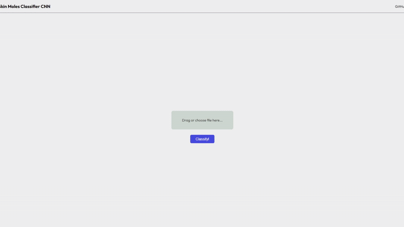

# Skin mole classifier CNN by winkele

A simple web application demonstrating a CNN (Convolutional neural network) for classifying skin moles from images as **benign**/**malignant**.

### The project consists of:
- The code used to train the model.
- The back-end script.
- The front-end.
- The pre-trained model.

### Tech stack:

* **Back-end:**
    * Python
    * FastAPI
    * Uvicorn
    * TensorFlow, Keras
    * Pillow
    * NumPy
* **Front-end:**
    * HTML
    * CSS
    * JavaScript
* **Model:**
    * Fine-tuned model for binary classification based on the pre-trained MobileNetV2

### Disclaimer
**This application was made strictly for educational and demostration purposes. This is not a medical diagnostic tool. This is not a substitute for professional medical advice, diagnosis or treatment. The model's accuracy is limited and it may produce incorrect classifications. Always consult with a qualified healthcare provider regarding any medical concerns or conditions. Do not disregard professional medical advice or delay seeking it because of something you have seen on this application.**

### Setup

Before setting this project up to run locally, please make sure you have **Python 3.10+**, **pip**, **git** and a **suitable browser**. You also will have to install the libraries mentioned above.

* Back-end setup
    * Clone the repository.
    * Install [Python 3.10+](https://www.python.org/downloads/release/python-3106/)
    * Install required libraries: `pip install tensorflow keras numpy pillow`
* Front-end setup
    * You do not need to do anything aside from cloning the repository.
* Final steps
    * Make sure directories included in `.py` files are valid. For example, the `MODEL_PATH` in `main.py` is set to the real path of savedmodel. If you are planning to use the training script, `development.py`, make sure directories in the code are also valid.
* Getting it running
    * Start the back-end server by running `main.py`.
    * Open the front-end (index.html). *Optional*: For best results consider running the front-end using a simple local server (*For example, the VSCode's Live Server extension*).

### Usage

* Start the application by following the steps in "*Getting it running*".
* Drag and drop a skin mole image onto the designated area, or click the area to browse and select the image.
* Click the "Classify!" button once the filename appears on the drop zone.
* The application will send the image to your local server for prediction (This might take some time).
* You will be redirected to `result.html` with the predicted data. *Note: You can see the raw JSON output by clicking "View raw JSON output..."*.

### Model details:

* Base model: MobileNetV2, which was pre-trained on the ImageNet dataset.
* Structure: The model has an additional preprocessing layer which normalizes the data to the range of [-1; 1]. It outputs a single value ranging from 0 to 1, 0 being benign and 1 being malignant. The base model's layers were replaced with custom layers (GlobalAveragePooling2d => Dropout => Dense).
* Training: The model was trained on [this dataset from kaggle.com by Claudio Fanconi](https://www.kaggle.com/datasets/fanconic/skin-cancer-malignant-vs-benign).
* Testaccuracy: The test accuracy of this model is approximately 0.8455.
